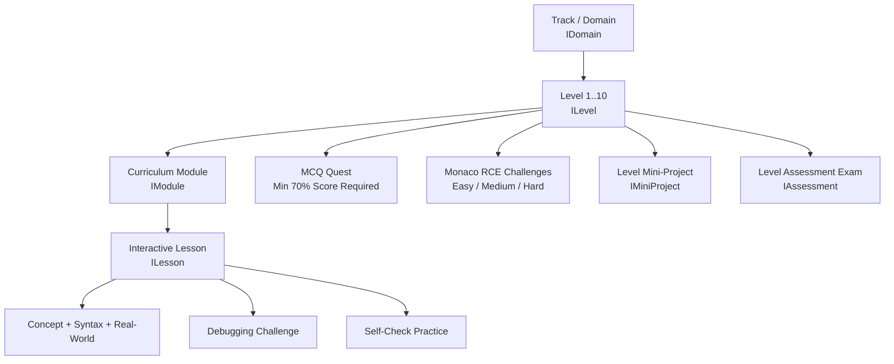
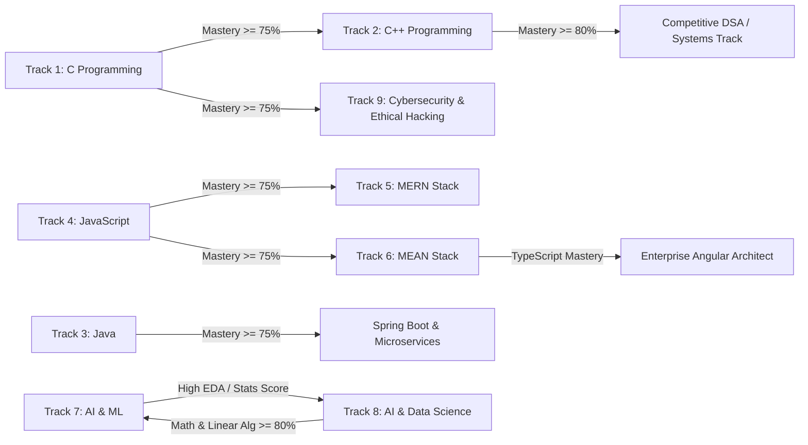

# Code Circle Platform: Master Multi-Track Curriculum Architecture

This document specifies the technical, educational, and computational foundation for **Code Circle's 9-Track, 90-Level Technology Learning Platform**.

---

## 1. System Hierarchy & Data Model Mapping

The educational curriculum maps to MongoDB documents and Fastify REST endpoints following this strict hierarchy:



### Database Schema Alignment

| Entity | Model in Codebase | Key Attributes |
| :--- | :--- | :--- |
| **Track (Domain)** | `Domain` (`domainModel.ts`) | `name`, `description`, `coverImageUrl`, `isLocked`, `approvedBy` |
| **Level** | `Level` (`levelModel.ts`) | `domainId`, `levelNumber` (1-10), `title`, `youtubeVideoId`, `studyMaterials[]`, `questQuestions[]`, `codingChallengeId`, `assessmentId` |
| **Coding Challenge** | `CodingChallenge` (`codingChallengeModel.ts`) | `title`, `description`, `difficulty`, `inputFormat`, `outputFormat`, `constraints`, `sampleInput`, `sampleOutput`, `starterCode (Map)`, `testCases[] (isHidden, expectedOutput)`, `timeLimitMinutes` |
| **Assessment** | `Assessment` (`assessmentModel.ts`) | `title`, `category`, `timeLimitMinutes`, `passingScorePercentage` (70%), `questions[]` (`questionText`, `options[]`, `correctOptionIndex`, `points`) |
| **Student Progress** | `StudentProgress` (`studentProgressModel.ts`) | `completedLevels[]`, `completedQuests[]`, `unlockedAssessments[]`, `unlockedCodingChallenges[]`, `completedCodingChallenges[]` |

---

## 2. Gatekeeper Pedagogical Learning Model

Every single level across all 9 tracks enforces a strict progression gate:

$$\text{Lesson Content} \longrightarrow \text{MCQ Quest} \xrightarrow[\ge 70\%]{\text{Gate}} \text{Coding Challenges (RCE)} \longrightarrow \text{Mini Project} \longrightarrow \text{Level Assessment} \longrightarrow \text{Level } N+1$$

1. **Lesson Exploration**: Conceptual notes, real-world industry case studies, syntax breakdowns, and interactive code walk-throughs.
2. **MCQ Quest Gatekeeper**: 10 rigorous, conceptual and output-prediction questions.
   - **Passing Threshold**: A student **MUST score $\ge 70\%$** to unlock the level's Monaco Editor RCE coding challenges.
   - **Feedback**: Detailed explanations are provided for failed options to close knowledge gaps before code compilation.
3. **Monaco Sandbox Coding Challenges**:
   - Progressive: 1 Easy, 1 Medium, and 1 Hard problem per level.
   - Real-time execution via Piston / Judge0 fallback sandbox.
   - Evaluated against public sample test cases and hidden edge test cases (timeouts, boundaries, memory limits).
4. **Mini Project / Capstone**:
   - Level 1: Micro-utility
   - Level 2: Command-line tool / logic script
   - Level 3: Interactive logic application
   - Level 4: Data-processing tool
   - Level 5: Intermediate modular application
   - Level 6: Structured architectural application
   - Level 7: Real-world connected application
   - Level 8: Advanced full-featured application
   - Level 9: Production-grade system
   - Level 10: Industry-ready Capstone project
5. **Level Assessment**: Timed, proctored comprehensive exam evaluating practical understanding.

---

## 3. Sandboxed RCE Execution Engine Specifications

All coding exercises and challenge starter codes are pre-formatted for browser-based **Monaco Editor** execution and server-side compilation via **Emkc Piston Engine** with **Judge0 Failover**:

```
[Student in Monaco Editor]
         │ (POST /api/coding/execute)
         ▼
[Code Circle Fastify Gateway]
         │ (Queue Concurrency Limiter: max 5 concurrent)
         ▼
[Emkc Piston Sandbox Container]
      ├── Primary: GCC 13 (C/C++), OpenJDK 21 (Java), Node.js 20 (JS), Python 3.12
      └── Fallback: Judge0 CE Docker Engine
         │ (Timeout: 5000ms, Memory Limit: 256MB)
         ▼
[Automated Test Runner Output Normalizer]
      ├── Trims whitespace and CRLF (\r\n -> \n)
      ├── Validates Public Test Cases
      └── Validates Hidden Edge Cases (Harness)
```

### Supported Language Standard Environments:
- **C**: ISO C17 (`gcc -O2 -std=c17 main.c -lm`)
- **C++**: ISO C++20 (`g++ -O2 -std=c++20 main.cpp`)
- **Java**: Java 21 LTS (`javac Main.java && java -Xmx256m Main`)
- **JavaScript**: Node.js 20 LTS (V8 Engine with ES Modules & CommonJS)
- **Python**: CPython 3.12 (NumPy, SciPy, Pandas pre-installed for AI tracks)

---

## 4. Gamification & Engagement Mechanics

### XP (Experience Points) Economy
| Activity | Base XP | Multipliers |
| :--- | :--- | :--- |
| Lesson Completed | +20 XP | $1.0\times$ |
| MCQ Quest Passed ($\ge 70\%$) | +50 XP | $+10\text{ XP}$ if $100\%$ score |
| Easy Coding Challenge Solved | +50 XP | First attempt bonus $+15\text{ XP}$ |
| Medium Coding Challenge Solved | +100 XP | First attempt bonus $+30\text{ XP}$ |
| Hard Coding Challenge Solved | +200 XP | First attempt bonus $+50\text{ XP}$ |
| Mini Project Completed & Reviewed | +300 XP | Code quality rubric score up to $+100\text{ XP}$ |
| Level Assessment Passed | +250 XP | Distinction ($\ge 90\%$) $+100\text{ XP}$ |
| Level 10 Capstone Completed | +1500 XP | Platform badge & verified credential |

### Daily Streaks & Streak Shields
- **Active Day**: Awarded upon completing $\ge 1$ lesson, quiz, or challenge.
- **Streak Multiplier**:
  - 7 Days: $1.1\times$ XP boost
  - 30 Days: $1.25\times$ XP boost
  - 100 Days: $1.5\times$ XP boost + "Centurion Coder" Badge
- **Streak Freeze**: Earnable every 5,000 XP (max 2 banked).

### Skill Tiers & Badges
1. **Novice** (0 – 1,500 XP): Level 1–2 completion
2. **Apprentice** (1,501 – 4,500 XP): Level 3–4 completion
3. **Practitioner** (4,501 – 9,000 XP): Level 5–6 completion
4. **Specialist** (9,001 – 15,000 XP): Level 7–8 completion
5. **Architect** (15,001 – 22,000 XP): Level 9 completion
6. **Master / Industry Ready** (22,001+ XP): Level 10 Capstone validated

---

## 5. Skill Graph Mathematical Modeling

The platform computes each student's granular competency score ($S_d$) across all domains:

$$S_d = \sum_{l=1}^{10} W_l \times \left( 0.20 \cdot Q_l + 0.35 \cdot C_l + 0.25 \cdot P_l + 0.20 \cdot A_l \right) \times \Phi(\text{attempts}, \text{decay})$$

Where:
- $W_l = \frac{l}{\sum_{k=1}^{10} k} = \frac{l}{55}$: Progressive level weighting factor (Level 10 has $10\times$ the weight of Level 1).
- $Q_l \in [0, 100]$: MCQ Quest score.
- $C_l \in [0, 100]$: Coding challenge pass rate ($\text{Solved Tests} / \text{Total Tests}$).
- $P_l \in [0, 100]$: Mini project evaluation rubric score.
- $A_l \in [0, 100]$: Level assessment score.
- $\Phi$: Penalty discount for retries ($\Phi = \max(0.70, 1.0 - 0.05 \times (\text{attempts} - 1))$).

### Multi-Dimensional Competency Vector:
```
Student Competency Matrix = [
  C_Systems_Proficiency:       [0..100]%,
  CPP_HighPerformance:        [0..100]%,
  Java_Enterprise_Backend:     [0..100]%,
  JavaScript_Modern_V8:        [0..100]%,
  MERN_FullStack:              [0..100]%,
  MEAN_FullStack:              [0..100]%,
  AI_MachineLearning:          [0..100]%,
  AI_DataScience:              [0..100]%,
  Cybersecurity_EthicalHacking: [0..100]%
]
```

---

## 6. Course Recommendation Engine Rules

The recommendation engine uses a directed dependency graph and performance telemetry to suggest the optimal next learning step:



### Recommendation Heuristic Rules:
1. **Rule 1 (Frontend/Full-Stack Transition)**: If `JavaScript.Score >= 75%` and student prefers React/Express, recommend **Track 5 (MERN Stack)**; if student excels in strict OOP and TypeScript, recommend **Track 6 (MEAN Stack)**.
2. **Rule 2 (Systems & Security Transition)**: If `C.Score >= 80%`, recommend **Track 9 (Cybersecurity & Ethical Hacking)** (focus on Memory Corruption, Buffer Overflows, Networking sockets).
3. **Rule 3 (Data & AI Specialization)**: If `Python.Score >= 80%` and `Statistical_Reasoning >= 75%`, recommend **Track 7 (AI & Machine Learning)**; if student prefers SQL, ETL, and Visual Analytics, recommend **Track 8 (AI & Data Science)**.
4. **Rule 4 (Enterprise Systems)**: If `Java.Score >= 80%`, recommend **Enterprise Cloud Microservices & Distributed Architecture**.
5. **Rule 5 (Remediation)**: If a student fails Coding Challenges $> 3$ times on memory or loops, automatically inject targeted DSA debugging modules before allowing Level advance.

---

## 7. Placement & Technical Interview Engine

Each track integrates collegiate placement training calibrated for Tier-1 and product companies (e.g., Zoho, Amazon, Microsoft, TCS Digital, Cognizant GenC Next):

1. **Output Prediction & Traps**:
   - C/C++: Pointer arithmetic, sequence points, macro side effects, virtual table dispatch.
   - Java: String pooling, autoboxing, polymorphism, exception hierarchy, static initialization blocks.
   - JavaScript: Event loop microtask queues, closure retention, prototype inheritance, `this` binding.
2. **DSA & Algorithmic Problem Solving**:
   - Sliding window, two pointers, topological sort, memoization, graph traversal (BFS/DFS), union-find.
3. **System Design & Architecture Interviews**:
   - Full stack tracks: REST vs GraphQL, WebSocket concurrency, indexing strategies, JWT vs session cookies, caching with Redis.
   - AI tracks: Overfitting mitigation, data drift, vector databases, RAG architectures, model quantization.
   - Security tracks: OWASP Top 10 mitigation, zero-trust network architectures, threat modeling via STRIDE.

---

## 8. Course Completion Report & Verified Credential

Upon completing Level 10 of any track, the platform generates an immutable JSON and PDF transcript containing:
- **Unique Credential ID**: Cryptographically hashed verification token (`CC-CERT-<TRACK_CODE>-<UUID>`).
- **Cumulative GPA / Percentage**: Weighted average across 10 Quest MCQs, 30 Monaco Challenges, and 10 Mini-Projects.
- **Competency Radar**: Scores across Syntax, Problem Solving, Clean Architecture, Security Best Practices, and Performance.
- **Verified Capstone Repository & Live Deployment Link**.
- **Industry Readiness Verdict**:
  - `70% - 79%`: Junior Developer / Intern Ready
  - `80% - 89%`: Associate Software Engineer Ready
  - `90% - 100%`: Full-Stack / Specialist Engineer Ready (Distinction)
