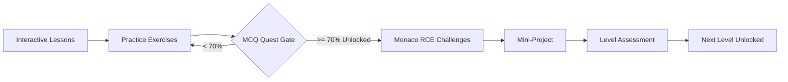

# Code Circle Multi-Track Learning Platform Curriculum Master Index ⭕

Welcome to the comprehensive curriculum specification for **Code Circle**. This curriculum contains **9 separate learning tracks**, each structured across **10 progressive levels** (totaling **90 levels**), taking collegiate students from absolute beginner foundations to industry-ready capstone engineering.

---

## 📚 Complete Track Directory

| Track # | Track Name | Category | Primary Stack | Duration | Track Specification Link |
| :---: | :--- | :--- | :--- | :---: | :--- |
| **Track 1** | **C Programming** | Systems & Core | C (ISO C17 / GCC) | 120 Hrs | [View Track 1 Spec](file:///c:/Users/rahul/OneDrive/Documents/code-circle/curriculum/tracks/track1_c_programming.md) |
| **Track 2** | **C++ Programming** | High-Performance | C++20 / GCC | 130 Hrs | [View Track 2 Spec](file:///c:/Users/rahul/OneDrive/Documents/code-circle/curriculum/tracks/track2_cpp_programming.md) |
| **Track 3** | **Java Programming** | Enterprise & Cloud | Java 21 LTS / Spring Boot | 130 Hrs | [View Track 3 Spec](file:///c:/Users/rahul/OneDrive/Documents/code-circle/curriculum/tracks/track3_java_programming.md) |
| **Track 4** | **JavaScript Programming** | Full-Stack Core | JS (Node.js 20 / ES2024) | 120 Hrs | [View Track 4 Spec](file:///c:/Users/rahul/OneDrive/Documents/code-circle/curriculum/tracks/track4_javascript_programming.md) |
| **Track 5** | **MERN Stack Development** | Full-Stack Web | React 19 + Express + Mongo | 140 Hrs | [View Track 5 Spec](file:///c:/Users/rahul/OneDrive/Documents/code-circle/curriculum/tracks/track5_mern_stack.md) |
| **Track 6** | **MEAN Stack Development** | Enterprise Web | Angular 18 + Express + Mongo | 140 Hrs | [View Track 6 Spec](file:///c:/Users/rahul/OneDrive/Documents/code-circle/curriculum/tracks/track6_mean_stack.md) |
| **Track 7** | **AI & Machine Learning** | Artificial Intelligence | PyTorch, Scikit-Learn, FastAPI | 140 Hrs | [View Track 7 Spec](file:///c:/Users/rahul/OneDrive/Documents/code-circle/curriculum/tracks/track7_ai_machine_learning.md) |
| **Track 8** | **AI & Data Science** | Data & Analytics | Pandas, SQL, DuckDB, Plotly | 135 Hrs | [View Track 8 Spec](file:///c:/Users/rahul/OneDrive/Documents/code-circle/curriculum/tracks/track8_ai_data_science.md) |
| **Track 9** | **Cybersecurity & Ethical Hacking** | Security & Auditing | Linux, Wireshark, ZAP, Python | 140 Hrs | [View Track 9 Spec](file:///c:/Users/rahul/OneDrive/Documents/code-circle/curriculum/tracks/track9_cybersecurity_ethical_hacking.md) |

---

## 🏛️ Platform Architecture & Database Documents

- [Platform Architecture Document](file:///c:/Users/rahul/OneDrive/Documents/code-circle/curriculum/CURRICULUM_ARCHITECTURE.md)
- [Curriculum TypeScript Interfaces](file:///c:/Users/rahul/OneDrive/Documents/code-circle/curriculum/types.ts)
- [Database Seed Pipeline](file:///c:/Users/rahul/OneDrive/Documents/code-circle/curriculum/seedAllTracks.ts)

---

## 🔄 The 10-Tier Pedagogical Model

Every level follows an unyielding progression pipeline:

### The 10 Project Tiers:
1. **Level 1**: Micro-Utility (Input/output formatting & conversion tool)
2. **Level 2**: Command-Line Logic Script (Algorithmic calculators & checkers)
3. **Level 3**: Logic-Based Interactive Application (Stateful menu apps)
4. **Level 4**: Data-Processing Application (Aggregators, statistics, transforms)
5. **Level 5**: Intermediate Modular Application (Multi-tier separation)
6. **Level 6**: Structured Architectural Application (Object-oriented & design patterns)
7. **Level 7**: Real-World Connected Application (Database/network-backed)
8. **Level 8**: Advanced Application (Concurrency, graphs, or distributed components)
9. **Level 9**: Production-Oriented Project (Containerized, cached, and tested)
10. **Level 10**: Major Industry-Ready Capstone (Full-featured production platform)
